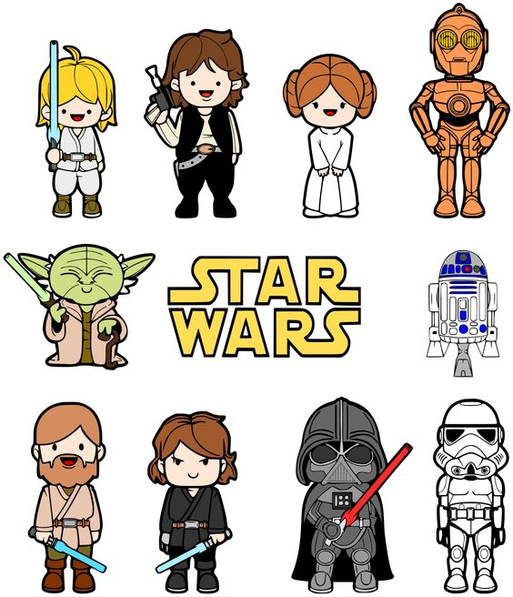

```{r, include=FALSE}
library(knitr)
knitr::opts_chunk$set(warning = TRUE,
                      echo = TRUE,
                      message = TRUE,
                      collapse = FALSE,
                      comment = "#>",
                      fig.align='center',
                      cache=FALSE)
## knitr::opts_knit$set(root.dir = '.')
```

## How to use this slides

### subtitle

- Press **Esc** to navigation mode
- Press **pageDown**, **Right** or **Down** to go to next slide
- Presss **PageUP**, **Left** or **Up** to go to previous slide

# 標題頁


## Hint

標題扣掉中文字元只剩下數字或空白會有跳頁錯誤

## <br/><br/>白底，白字標題 {.white}


`class="cover" 是滿版圖`<br/>


## <br/><br/>黑底，灰字標題 {.black}

<p style='color:white'>
白字
</p>
<p class="white">
這也是白字
</p>

##  

可以沒有標題

<div align="center" style="font-size: 250%">
<p>課程資訊</p>
<a target="_blank" href="http://data-sci.info/r-crawler-101/">網站</a>/
<a target="_blank" href="http://data-sci.info/forums/">論壇</a>/
<a target="_blank" href="https://www.facebook.com/datasci.info">粉絲頁</a>/
<a target="_blank" href="https://goo.gl/rt7uAJ">廣播</a>/
<a target="_blank" href="https://goo.gl/ennxQz">共筆</a>
</div>

<div align="center">
<h3>
課後若有任何問題歡迎至論壇發問
</h3>
</div>


## 內容置中

<div align="center" style="font-size: 250%">
我是置中文字
</div>
```{r}
print("hihi")
```

## 圖片滿寬，自動根據頁面調整大小


## 圖片 70% 寬


## 圖片 90% 寬, 90％ 高


## 圖片指定 400px 寬

<a target="_blank" href="http://www.family.com.tw/marketing/inquiry.aspx">

</a>


## 圖片滿版置中part1 { .fullpage }


## 圖片滿版置中part2 { .fullpage }

<div class="fullpage width">
```{r, echo=FALSE, dev='svg'}
par(mar = c(5, 4, 1, 2) + 0.1)
pairs(iris[1:4], pch = 21,
      bg = c("red", "green3", "blue")[unclass(iris$Species)])
```
</div>

## 兩欄獨立圖片

<div class="double">
<p class="double">
```{r, echo=FALSE, dev='svg', out.width=420}
par(mar = c(5, 4, 1, 2) + 0.1)
pairs(iris[1:4], pch = 21,
      bg = c("red", "green3", "blue")[unclass(iris$Species)])
```
</p>
<p class="double-flow">

</p>
</div>

## 兩欄 (連續) image and text

<p class="double">

How did I get into this mess? I really don't know how. We seem to be made
to suffer. It's our lot in life. I've got to rest before I fall apart. My
joints are almost frozen. What a desolate place this is. Where are you
going?
</p>

## 兩欄獨立

<div class="double">
<p class="double-flow">
How did I get into this mess? I really don't know how. We seem to be made
to suffer.
</p>
<p class="double-flow">
It's our lot in life. I've got to rest before I fall apart.

</p>
</div>

## Formulas

Formulas are rendered by KaTeX, https://github.com/Khan/KaTeX

It supports both inline: \(y = x / 2\) and displayed formulas:

\[ x_{1,2} = \frac{- b \pm \sqrt{b^2 - 4ac}}{2a} \]

## Lists item by item

> 1. Lets you reveal list items one by one
> 2. To keep some key points
> 3. In secret from audience
> 4. But it will work only once
> 5. Nobody wants to see the same joke twice


